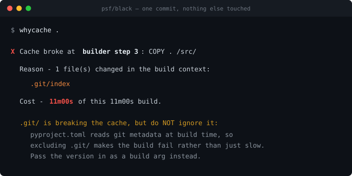

# whycache

[](https://pypi.org/project/whycache/)
[](https://pypi.org/project/whycache/)
[](LICENSE)

**Docker tells you *that* the build cache broke. `whycache` tells you *why*, which file did it, and what it cost you.**



That is a real run against [psf/black](https://github.com/psf/black). Every commit
costs an eleven-minute rebuild, because `COPY . /src/` pulls in `.git`, which
changes on every commit, and the expensive `apt install` + `pip install` +
`hatch build` steps all sit below it.

Nobody on that project is doing anything wrong. It is simply invisible — Docker
prints which steps re-ran, never why.

---

## Install

```bash
pip install whycache
```

No daemon, no account, no config, no network calls. One dependency-free CLI.

## Use

```bash
whycache                       # build the current directory
whycache path/to/project       # or somewhere else
whycache . -- --build-arg V=2  # anything after -- goes to docker build
```

Run it once to record a baseline, then run it again after you change something.

## What it tells you

**A file changed.** Which one, and only the ones that instruction actually copies:

```console
X Cache broke at build step 10:  COPY src ./src

  Reason - 1 file(s) changed in the build context:

    src/sqlfluff/api/info.py

  Cost - 7.5s of this 7.5s build.
```

**A build arg changed.** Docker substitutes args into the command before caching
it, so the change is visible if you know where to look:

```console
X Cache broke at step 2:  RUN echo "building 3.0.0" > /version

  Reason - the instruction itself changed since the last build:

    was:  RUN echo "building 2.0.0" > /version
    now:  RUN echo "building 3.0.0" > /version
```

**Junk is polluting your build context.** With a concrete fix:

```console
  Fix - add to .dockerignore:
    .git/                  (changes on every commit, 2 file(s))
    node_modules/          (reinstallable from lockfile, 41 file(s))

  Saves ~4m12s per build.
```

**...unless that fix would break your build.** `black` derives its version from
git via `hatch-vcs`, so ignoring `.git/` does not make the build slower — it
makes it fail:

```console
  .git/ is breaking the cache (1 file(s)), but do NOT ignore it:
    pyproject.toml reads git metadata at build time, so excluding
    .git/ makes the build fail rather than just slow.
```

This one is not hypothetical. An earlier version of this tool gave that advice,
and broke `black`'s build with it.

## The number tells you if your Dockerfile is well built

Same tool, three real projects, four measurements:

| Project | What changed | Cache broke at | Cost |
|---|---|---|---|
| [psf/black](https://github.com/psf/black) | one commit | `COPY . /src/` (step 3 of 6) | **11m00s** |
| [sqlfluff](https://github.com/sqlfluff/sqlfluff) | one source file | `COPY src ./src` (step 10 of 12) | 7.5s |
| [traefik/whoami](https://github.com/traefik/whoami) | `go.mod` | `COPY go.mod .` (step 4) | 30.2s |
| traefik/whoami | `app.go` | `COPY . .` (step 7) | 29.6s |

A miss high in the Dockerfile is expensive because everything below it re-runs.
A miss near the bottom is cheap. **That gap is the entire skill of writing a
Dockerfile**, and this is what makes it visible.

## How it works

1. Runs your build with `--progress=rawjson` and reads the structured output.
2. Finds the first step that was not `CACHED`.
3. Fingerprints your build context, honouring `.dockerignore`, and diffs it
   against the last run.
4. Sums the time of every step that re-ran.

State lives in `~/.whycache/`, keyed by project path. Nothing is written into
your build context — doing that would change the context and break the cache,
which is the exact problem this tool exists to report.

## What it will not do

- **It will not edit your Dockerfile.** It tells you; you decide.
- **It will not guess.** If the cache was cold, or the cause is outside the
  build context, it says so and names no file. A confidently wrong answer is
  worse than no answer, so it declines rather than blames.
- **No AI.** This is a deterministic diff of two file lists. An LLM would make
  it slower, costlier, and less trustworthy.

## How it compares

| Tool | Answers |
|---|---|
| [`dive`](https://github.com/wagoodman/dive) | How much **space** is wasted in the image |
| [`hadolint`](https://github.com/hadolint/hadolint) | Does the Dockerfile follow **style** rules |
| **`whycache`** | Why the cache missed **on this build**, and what it cost |

Different questions. `dive` and `hadolint` are both excellent; neither answers this one.

## Requirements

- Docker with BuildKit (the default since Docker 23)
- Python 3.10+

Works on Linux, macOS, and Windows. It is developed on Windows, so the console
output degrades to ASCII rather than crashing on cp1252 — a courtesy most
Linux-first tooling forgets.

## Overhead

Fingerprinting a 5,955-file / 25 MB context takes **~730 ms** on a warm run,
because unchanged files are never reopened. First run on a project costs ~6 s.

## Contributing

Bug reports with a Dockerfile that reproduces are the most useful thing you can
send. The test suite runs without Docker except for `test_e2e.py`:

```bash
python test_dockerignore.py    # .dockerignore matching
python test_whycache.py        # step parsing, blame, git-versioning guard
python -m whycache.manifest    # context fingerprinting
python test_e2e.py             # full run against a real build (needs Docker)
```

## License

MIT
